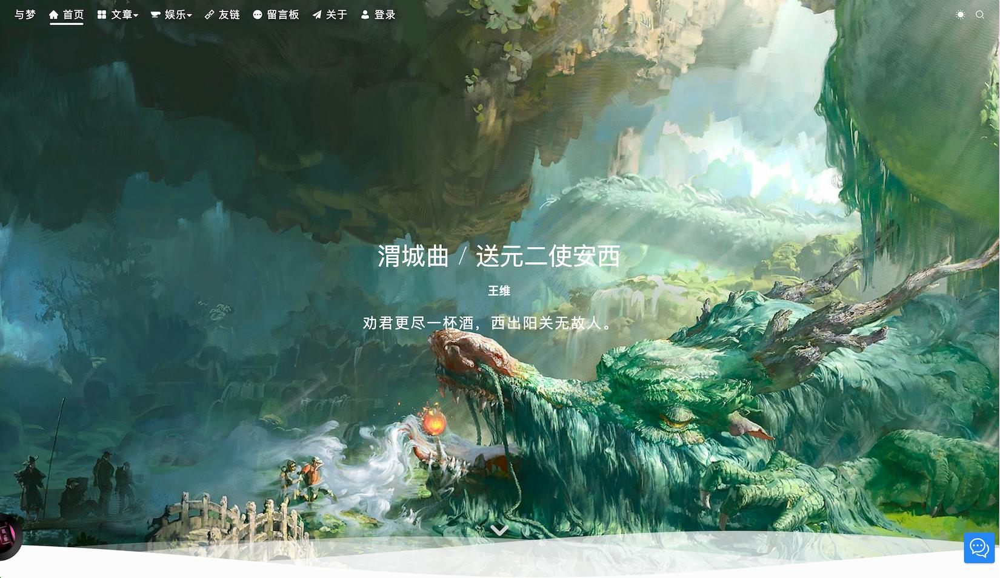
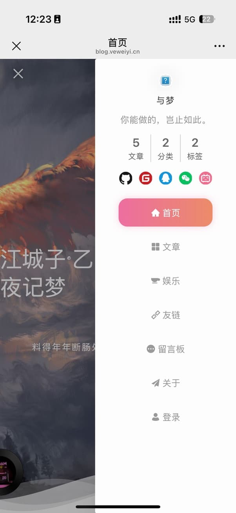

<div align=center>
  

  <h1>ve-blog-naive</h1>

  
  
  
  
  
  

</div>


<div align="center">
  <a target="_blank" href="https://blog.veweiyi.cn">🖥️ 在线预览</a> |
  <a target="_blank" href="https://blog.veweiyi.cn/blog-api/v1/swagger/index.html">📑 接口文档</a>
</div>

## 📚 项目简介

ve-blog-naive 是一个现代化的的现代化博客系统，基于 Vue 3.5 + TypeScript + Naive UI 构建。项目采用最新的前端技术栈，提供了丰富的功能组件和优雅的用户界面。

## ✨ 项目预览




📲 **移动端**

|                |                |                |
|----------------|----------------|----------------|
|  |  |  |


## ⚡ 核心特性

- 🚀 **高性能前端架构**
  - 基于 Vue 3 + TypeScript + Vite 4 构建
  - 采用组合式 API 开发，代码更清晰易维护
  - 支持按需加载，极致的首屏加载速度

- 🎨 **优雅的用户界面**
  - 集成 Naive UI 组件库，提供专业级 UI 组件
  - 精心设计的响应式布局，完美适配各种设备
  - 支持深色/浅色主题切换，保护用户眼睛

- 📝 **强大的内容管理**
  - 支持 Markdown 编辑器，轻松编写文章
  - 智能的图片管理系统，支持相册功能
  - 文章分类和标签管理，内容组织更清晰

- 🔍 **智能搜索系统**
  - 全文搜索功能，快速定位内容
  - 支持文章归档，按时间轴浏览
  - 智能分类管理，内容检索更便捷

## 🛠️ 技术栈

- 核心框架：Vue 3.5.13
- UI 组件：Naive UI 2.42.0
- 构建工具：Vite 6.2.6
- 编程语言：TypeScript 5.8.2
- 状态管理：Pinia 3.0.1
- CSS 解决方案：UnoCSS 65.4.3
- HTTP 工具：Axios 1.8.2
- 工具库：lodash-es、dayjs
- 图表：ECharts 5.6.0

## 📁 项目源码

| 项目               | 功能     | Github                                                               |                                                                     |
|------------------|--------|----------------------------------------------------------------------|---------------------------------------------------------------------|
| ve-blog-golang   | 博客后端服务 | [ve-blog-golang](https://github.com/ve-weiyi/ve-blog-golang.git)     | [ve-blog-golang](https://gitee.com/ve-weiyi/ve-blog-golang.git)     |
| ve-blog-naive    | 博客前台展示 | [ve-blog-naive](https://github.com/ve-weiyi/ve-blog-naive.git)       | [ve-blog-naive](https://gitee.com/ve-weiyi/ve-blog-naive.git)       |
| ve-admin-element | 博客后台管理 | [ve-admin-element](https://github.com/ve-weiyi/ve-admin-element.git) | [ve-admin-element](https://gitee.com/ve-weiyi/ve-admin-element.git) |

## 🏗️ 项目结构

```
ve-blog-naive
├── .github/            # GitHub 工作流配置
├── public/             # 静态资源
├── src/                # 源代码
│   ├── api/           # API 接口
│   ├── assets/        # 项目资源
│   ├── components/    # 公共组件
│   ├── directives/    # 自定义指令
│   ├── plugins/       # 插件配置
│   ├── router/        # 路由配置
│   ├── store/         # 状态管理
│   ├── types/         # 类型定义
│   ├── utils/         # 工具函数
│   ├── views/         # 页面组件
│   ├── App.vue        # 根组件
│   ├── main.ts        # 入口文件
│   └── permission.ts  # 权限控制
├── .env               # 环境变量配置
├── .env.dev           # 开发环境配置
├── .env.prod          # 生产环境配置
├── .env.test          # 测试环境配置
├── .eslintrc.js       # ESLint 配置
├── .prettierrc.js     # Prettier 配置
├── docker-compose.yaml # Docker 编排配置
├── Dockerfile         # Docker 构建配置
├── index.html         # HTML 模板
├── nginx.conf         # Nginx 配置
├── package.json       # 项目依赖
├── tsconfig.json      # TypeScript 配置
├── uno.config.ts      # UnoCSS 配置
└── vite.config.ts     # Vite 配置
```

## 🚀 快速开始

### 环境要求

- Node.js >= 20
- pnpm >= 9

### 开发环境

```bash
# 克隆项目
git clone https://github.com/ve-weiyi/ve-blog-naive.git

# 进入项目目录
cd ve-blog-naive

# 安装依赖
pnpm install

# 启动开发服务器
pnpm dev
```

### 生产环境

```bash
# 构建生产版本
pnpm build
```

### Docker部署

```bash
docker run -d \
--name ve-blog-naive \
--restart always \
-p 9420:80 \
ghcr.io/ve-weiyi/ve-blog-naive:latest
```

## 📋 开发计划

### ✅ 已完成功能

- [x] 相册页面
- [x] 相册详情页面
- [x] 基础博客功能
- [x] 响应式布局
- [x] 主题切换

### 🚧 开发中功能

- [ ] 相册详情页面照片获取优化
- [ ] 归档页面时间轴重构
- [ ] 性能优化
- [ ] SEO 优化

## 🤝 贡献指南

欢迎提交 Issue 和 Pull Request 来帮助改进项目。在提交代码前，请确保：

1. 代码符合项目的编码规范
2. 添加必要的测试用例
3. 更新相关文档

## 📄 开源协议

本项目采用 MIT 协议开源，详情请查看 [LICENSE](LICENSE) 文件。
